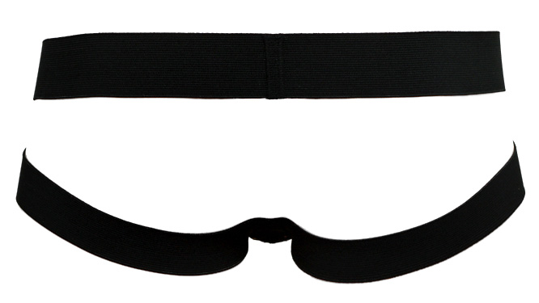

<strong><ins>J</ins></strong><s>avascript</s> &plus; <s>m</s><strong><ins>OCKS</ins></strong> &equals;

<h4 align="center">&hearts; JOCKS &hearts;</h4>

<em>&ldquo;they ain't just for show anymore...&rdquo;</em>

### mocks suck.

Unless you've been schooled in hardcore testing (like it's your full-time job) you're probably using them wrong.

If they require custom functionality and/or hard-coding they become a huge maintenence burden and tests don't get run.

### who cares.

**JOCKS** *(pronounced like "Jacques" (French: [?ak]))* doesn't. It wasn't built for unit testing, although you can of course use it for that. (although things like testing private functionality (think iOS's @testable) is pretty cool!)

It was built to:

- get projects up and running quickly
- provide functionality you're waiting on someone else to deliver (like an API)
- Provide seemless &ldquo;jock&rdquo; &rarr; &ldquo;real&rdquo; workflow
- Utilize ASTs to be smarter at code generation
- That's it.